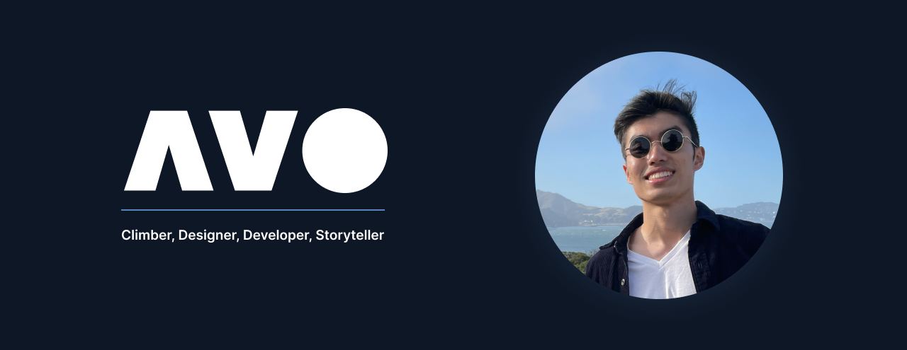

<h1 align='left'>
  Hey there! My name's Andy 👋
</h1>

  I'm an alumnus of Boston University, incoming UC Berkeley MIMS candidate, and I design/develop mobile and web apps for freelancing work on the side. I have a passion for storytelling and I share that through personal and professional projects. Feel free to take a look at some of my work on <a href="https://andyvo.com">my website</a>. If you have an idea in mind, let's set up a coffee chat ☕ !

<h2 align='left'>
  Current Project 👨‍💻
</h2>

  <a href="https://patternfly-react-main.surge.sh/"><b>PatternFly 4</b></a> - Red Hat's open source design system. As a Red Hate UXD Software Engineering Intern for the UXD Team, I'm excited to be contributing the open source way.

<h2 align='left'>
  My Daily Tools 🔨
</h2>

  
  &nbsp;&nbsp;
  
  &nbsp;&nbsp;
  
  &nbsp;&nbsp;
  
  &nbsp;&nbsp;
  
  &nbsp;&nbsp;
  
  &nbsp;&nbsp;
  
  &nbsp;
  and a lot more 😅

  
<h2 align='left'>
  Let's Connect 🤝
</h2>

  
  &nbsp;&nbsp;
  
  &nbsp;&nbsp;
  

<!--
**andyyvo/andyyvo** is a ✨ _special_ ✨ repository because its `README.md` (this file) appears on your GitHub profile.

Here are some ideas to get you started:

- 🔭 I’m currently working on ...
- 🌱 I’m currently learning ...
- 👯 I’m looking to collaborate on ...
- 🤔 I’m looking for help with ...
- 💬 Ask me about ...
- 📫 How to reach me: ...
- 😄 Pronouns: ...
- ⚡ Fun fact: ...
-->
